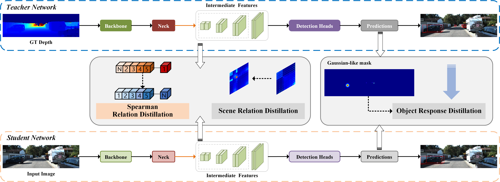

# MonoSKD

<p align="center">  </p>

## Introduction

This is the PyTorch implementation of the paper DID-M3D: Decoupling Instance Depth for Monocular 3D Object Detection, In ECAI'23, Sen Wang and Jin Zheng.
[[paper]](https://arxiv.org/abs/2310.11316) 

## Abstract

Monocular 3D object detection is an inherently ill-posed problem, as it is challenging to predict accurate 3D localization from a single image. Existing monocular 3D detection knowledge distillation methods usually project the LiDAR onto the image plane and train the teacher network accordingly. Transferring LiDAR-based model knowledge to RGB-based models is more complex, so a general distillation strategy is needed. To alleviate cross-modal problem, we propose **MonoSKD**, a novel **K**nowledge **D**istillation framework for **Mono**cular 3D detection based on **S**pearman correlation coefficient, to learn the relative correlation between cross-modal features. Considering the large gap between these features, strict alignment of features may mislead the training, so we propose a looser Spearman loss. Furthermore, by selecting appropriate distillation locations and removing redundant modules, our scheme saves more GPU resources and trains faster than existing methods. Extensive experiments are performed to verify the effectiveness of our framework on the challenging KITTI 3D object detection benchmark. Our method achieves state-of-the-art performance until submission with no additional inference computational cost. Our code will be made public once accepted.

## Overview

- [Installation](#installation)
- [Getting Started](#getting-started)
- [Pretrained Model](#pretrained-model)

## Installation

### Installation Steps

a. Clone this repository.

b. Install the dependent libraries as follows:

* Install the dependent python libraries: 
  
  ```shell
  pip install torch==1.12.0 torchvision==0.13.0 pyyaml scikit-image opencv-python numba tqdm torchsort
  ```

* We test this repository on Nvidia 3090 GPUs and Ubuntu 18.04. You can also follow the install instructions in [GUPNet](https://github.com/SuperMHP/GUPNet) (This respository is based on it) to perform experiments with lower PyTorch/GPU versions.

## Getting Started

### Dataset Preparation

* Please download the official [KITTI 3D object detection](http://www.cvlibs.net/datasets/kitti/eval_object.php?obj_benchmark=3d) dataset and organize the downloaded files as follows:

```
this repo
├── data
│   │── KITTI3D
|   │   │── training
|   │   │   ├──calib & label_2 & image_2 & depth_dense
|   │   │── testing
|   │   │   ├──calib & image_2
├── config
├── ...
```

* You can also choose to link your KITTI dataset path by
  
  ```
  KITTI_DATA_PATH=~/data/kitti_object
  ln -s $KITTI_DATA_PATH ./data/KITTI3D
  ```

* To ease the usage,  the pre-generated dense depth files at: [Google Drive](https://drive.google.com/file/d/1mlHtG8ZXLfjm0lSpUOXHulGF9fsthRtM/view?usp=sharing) 

### Training & Testing

#### Test and evaluate the pretrained models

```shell
CUDA_VISIBLE_DEVICES=0 python tools/train_val.py --config config/monoskd.yaml -e   
```

#### Train a model

```shell
CUDA_VISIBLE_DEVICES=0,1,2,3 python tools/train_val.py --config configs/monoskd.yaml
```

## Pretrained Model

To ease the usage, we will provide the pre-trained model at [Google Drive](https://drive.google.com/file/d/1gy6sviLT9yLOLYNs7dzYjWrj02s0-u8O/view?usp=sharing)

Considering that the trained model usually contains the weights of the teacher network, we use the script of `tools/pth_transfer.py` to delete the teacher network weights.

We provide the model reported in the paper and training logs for everyone to verify (`mAP=20.21`).

It is worth noting that `drop_last = True` during the training process, so the final inference result will have negligible accuracy error, which is reasonable.

Here we give the comparison.

<table align="center">
    <tr>
        <td rowspan="2",div align="center">Models</td>
        <td colspan="3",div align="center">Car@BEV IoU=0.7</td>    
        <td colspan="3",div align="center">Car@3D IoU=0.7</td>  
    </tr>
    <tr>
        <td div align="center">Easy</td> 
        <td div align="center">Mod</td> 
        <td div align="center">Hard</td> 
        <td div align="center">Easy</td> 
        <td div align="center">Mod</td> 
        <td div align="center">Hard</td>  
    </tr>
    <tr>
        <td div align="center">original paper</td>
        <td div align="center">37.66</td> 
        <td div align="center">26.41</td> 
        <td div align="center">23.39</td> 
        <td div align="center">28.91</td> 
        <td div align="center">20.21</td> 
        <td div align="center">16.99</td> 
    </tr>    
    <tr>
        <td div align="center">this repo</td>
        <td div align="center">37.66</td> 
        <td div align="center">26.41</td> 
        <td div align="center">23.39</td> 
        <td div align="center">28.89</td> 
        <td div align="center">20.19</td> 
        <td div align="center">16.98</td> 
    </tr>
</table>

## Citation

TODO
<!-- ```
@inproceedings{peng2022did,
  title={DID-M3D: Decoupling Instance Depth for Monocular 3D Object Detection},
  author={Peng, Liang and Wu, Xiaopei and Yang, Zheng and Liu, Haifeng and Cai, Deng},
  booktitle={European Conference on Computer Vision},
  year={2022}
}
``` -->

## Acknowledgements

This respository is mainly based on [GUPNet](https://github.com/SuperMHP/GUPNet), and it also benefits from [DID-M3D](https://github.com/SPengLiang/DID-M3D). Thanks for their great works!
